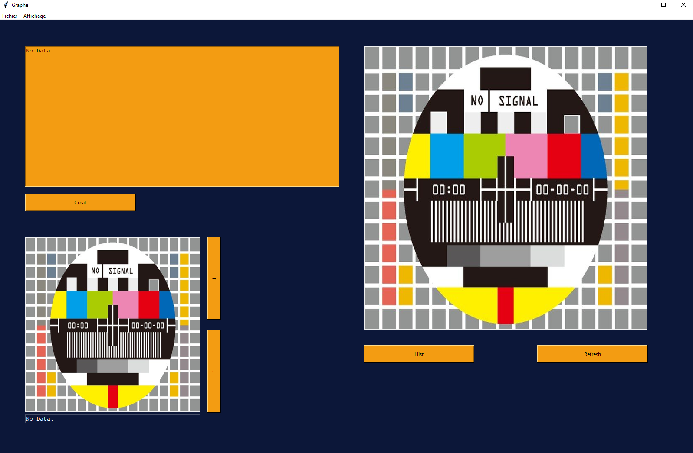
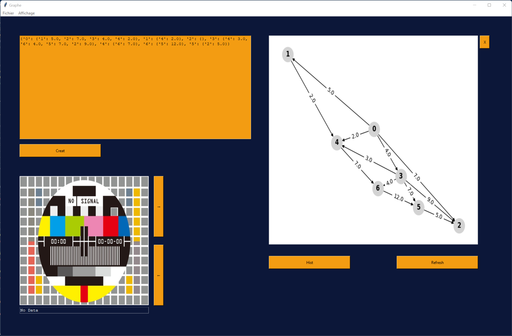
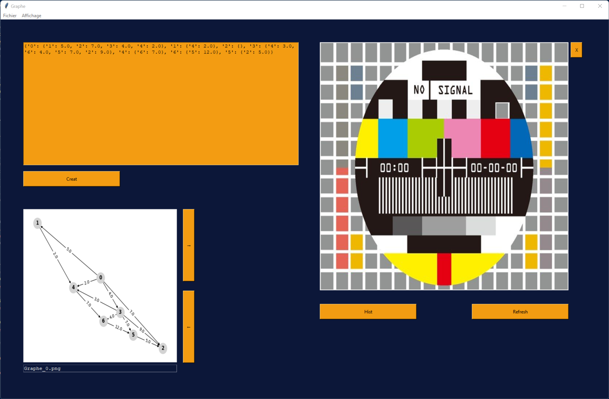

# 🖥️ Gestion et Visualisation des Graphes

Ce projet Python permet de manipuler, analyser et visualiser différents types de graphes grâce à une interface utilisateur développée avec Tkinter. Il prend en charge plusieurs types de graphes (orientés, non orientés, pondérés) et propose des fonctionnalités telles que la création, la visualisation et la gestion des fichiers d'historique.

## ✨ Fonctionnalités

### 🔧 Manipulation des Graphes
- **Ajout de sommets et d'arêtes/arcs** : Créez des graphes personnalisés.
- **Parcours** : Effectuez des parcours en profondeur et en largeur.
- **Matrice d'adjacence** : Visualisez la représentation matricielle des graphes.

### 🎨 Visualisation
- **Interface utilisateur** : Interface intuitive pour charger des fichiers CSV et choisir le type d'affichage (graphe, dictionnaire, ou les deux).
- **Historique** : Suivez vos manipulations passées avec des images générées automatiquement pour chaque graphe.

### 🗂️ Types de Graphes Pris en Charge
- Graphes non orientés
- Graphes orientés
- Graphes orientés pondérés

## 📸 Captures d'écran
Ajoutez ici des captures d'écran de votre application pour illustrer son interface et ses fonctionnalités. Par exemple :

<table>
  <tr>
    <td>
      
      <p><em>Interface principale</em></p>
    </td>
    <td>
      
      <p><em>Exemple de graphe.</em></p>
    </td>
  </tr>
  <tr>
    <td>
      
      <p><em>Exemple d'historique </em></p>
    </td>
  </tr>
</table>

## Dépendances Python (pip) 📦

Pour exécuter correctement le backend de ce projet, installez les dépendances suivantes :

```bash
pip install pillow
pip install networkx
pip install matplotlib
pip install pathlib
pip install -r requirements.txt
```

## 📖 Utilisation

### ▶️ Lancement de l'Application
Exécutez le script principal `Prot15.py` :
```bash
python Prot15.py
```

### 🖱️ Fonctionnement de l'Interface
1. **📂 Charger un fichier CSV** : Cliquez sur `Fichier > Fichier CSV` pour sélectionner un fichier contenant les définitions des graphes.
2. **📊 Choisir l'affichage** : Sélectionnez parmi les options dans `Affichage` pour voir le dictionnaire, le graphe, ou les deux.
3. **⚙️ Créer un graphe** : Utilisez le bouton `Creat` pour générer le graphe selon vos préférences.
4. **🕒 Historique** : Naviguez dans les graphes précédemment créés grâce aux boutons de navigation.

### 📂 Format des Fichiers CSV
Les fichiers CSV doivent respecter l'un des formats suivants :
- `G, N, N` : Graphe non orienté non pondéré.
- `G, O, P` : Graphe orienté pondéré.
- `G, O, N` : Graphe orienté non pondéré.

Chaque ligne du fichier décrit une arête ou un arc :
```
sommet1, sommet2 [, poids]
```

## 🏗️ Architecture du Code

### 📁 Fichiers Principaux
- **`classes_graphes.py`** : Définit les classes pour gérer les graphes.
- **`PILE.py`** : Implémente les structures de données Pile et File utilisées dans les algorithmes de parcours.
- **`Prot15.py`** : Point d'entrée principal, contenant l'interface utilisateur et les fonctions de liaison entre les graphes et leur visualisation.

### 📂 Dossiers Importants
- **`img/Hist/`** : Contient les images des graphes générées pour l'historique.
- **`img/Temp/`** : Stocke temporairement les graphes générés.
